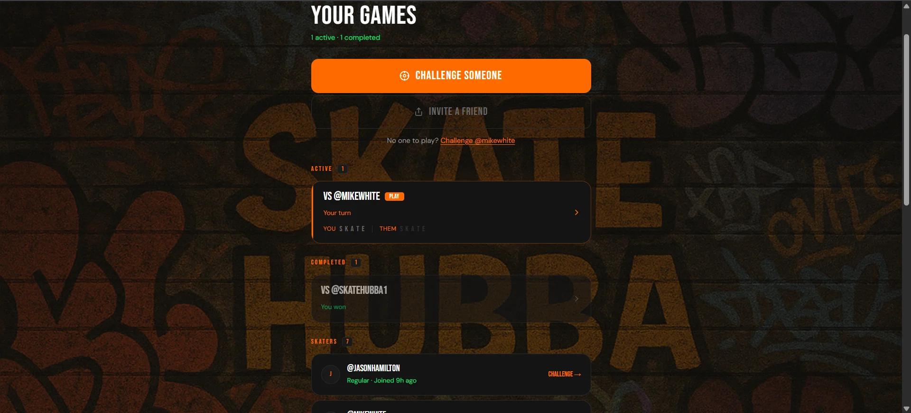
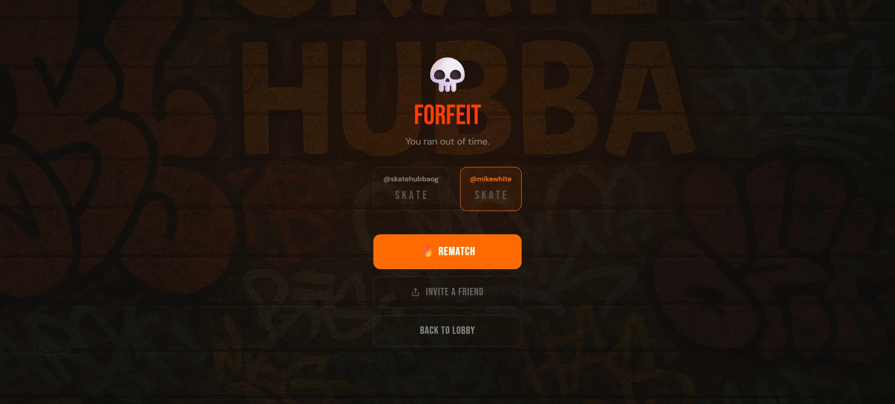

<div align="center">

<!-- GitHub dark mode: show white logo; light mode: show black logo -->
<picture>
  <source media="(prefers-color-scheme: dark)" srcset="docs/screenshots/logo-white.webp">
  <source media="(prefers-color-scheme: light)" srcset="docs/screenshots/logo-black.png">
  
</picture>

### Own the spot. Play S.K.A.T.E. anywhere.

An async multiplayer trick battle game for skateboarders.
Challenge friends, set tricks on video, and see if they can match you — one letter at a time.

[](https://skatehubba.com)
[](https://github.com/myhuemungusD/SkateHubba-play/actions/workflows/main.yml)
[](LICENSE)
[](CONTRIBUTING.md)

[](https://react.dev)
[](https://www.typescriptlang.org)
[](https://vite.dev)
[](https://firebase.google.com)
[](https://tailwindcss.com)
[](https://github.com/myhuemungusD/SkateHubba-play/releases)

<br>


</div>

<br>

## What is S.K.A.T.E.?

S.K.A.T.E. is the skateboarding version of HORSE. One player sets a trick; the other must land it. Miss and you earn a letter — **S**, then **K**, then **A**, then **T**, then **E**. First to spell it out loses.

This app brings that to your phone, async. Set your trick whenever, opponent matches whenever. No need to be at the same spot or online at the same time.

---

## Screenshots

<div align="center">
<table>
<tr>
<td align="center"><strong>Landing Page</strong></td>
<td align="center"><strong>Your Games</strong></td>
<td align="center"><strong>Forfeit Screen</strong></td>
</tr>
<tr>
<td></td>
<td></td>
<td></td>
</tr>
</table>
</div>

---

## Tech Stack

| Layer    | Technology                                              |
| -------- | ------------------------------------------------------- |
| Frontend | React 18, TypeScript, Vite                              |
| Styling  | Tailwind CSS (dark theme, custom brand tokens)          |
| Auth     | Firebase Authentication (email/password + Google OAuth) |
| Database | Cloud Firestore (real-time, offline-capable)            |
| Storage  | Firebase Storage (trick videos in WebM)                 |
| Hosting  | Vercel                                                  |
| Testing  | Vitest, @testing-library/react                          |
| CI       | GitHub Actions                                          |

No custom backend. No serverless functions. The client talks directly to Firebase with security enforced by Firestore rules.

---

## Features

- **Async gameplay** — players take turns on their own schedule
- **Video tricks** — record one-take WebM videos in-browser
- **Real-time updates** — both players see game state the moment it changes
- **24-hour turn timer** — games don't stall; expired turns auto-forfeit
- **Google OAuth** — popup sign-in with redirect fallback for mobile/Safari
- **Email verification** — required before play; resend from the app
- **Atomic username reservation** — no two players share a handle (Firestore transaction)
- **Offline support** — Firestore local cache lets you read games without internet
- **PWA-ready** — installable on iOS and Android
- **Security rules** — all game logic validated server-side; client can't cheat scores

---

## Quick Start

```bash
git clone https://github.com/myhuemungusD/SkateHubba-play.git
cd SkateHubba-play
npm install
cp .env.example .env.local
# Fill in your Firebase config values in .env.local
npm run dev
```

Open [http://localhost:5173](http://localhost:5173).

For full setup including Firebase emulators, see [docs/DEVELOPMENT.md](docs/DEVELOPMENT.md).

---

## Scripts

| Command              | Description                           |
| -------------------- | ------------------------------------- |
| `npm run dev`        | Start dev server at localhost:5173    |
| `npm run build`      | Type-check + production build → dist/ |
| `npm run preview`    | Preview the production build locally  |
| `npm test`           | Run test suite once                   |
| `npm run test:watch` | Run tests in watch mode               |

---

## Project Structure

```
skatehubba-play/
├── public/                  # Static assets served at /
├── src/
│   ├── App.tsx              # Screens + state machine
│   ├── firebase.ts          # Firebase init
│   ├── main.tsx             # React entry
│   ├── index.css            # Tailwind + custom animations
│   ├── hooks/
│   │   └── useAuth.ts       # Auth state + profile hook
│   ├── services/
│   │   ├── auth.ts          # Sign up, sign in, Google OAuth, password reset
│   │   ├── users.ts         # Profiles + atomic username reservation
│   │   ├── games.ts         # Game CRUD + real-time subscriptions
│   │   └── storage.ts       # Video upload to Firebase Storage
│   └── __tests__/
│       └── smoke-e2e.test.tsx
├── docs/                    # Documentation suite
│   └── screenshots/         # README images + brand assets
├── firestore.rules          # Firestore security rules
├── storage.rules            # Storage security rules
├── .env.example             # Environment variable template
└── vercel.json              # Vercel SPA config
```

---

## Environment Variables

Copy `.env.example` to `.env.local` and fill in values from your Firebase project:

```
VITE_FIREBASE_API_KEY=
VITE_FIREBASE_AUTH_DOMAIN=
VITE_FIREBASE_PROJECT_ID=
VITE_FIREBASE_STORAGE_BUCKET=
VITE_FIREBASE_MESSAGING_SENDER_ID=
VITE_FIREBASE_APP_ID=
VITE_FIREBASE_MEASUREMENT_ID=   # optional — Analytics
VITE_USE_EMULATORS=true         # optional — local emulators
VITE_APP_URL=https://...        # optional — email action redirects
```

---

## Documentation

| Document                                         | Description                                 |
| ------------------------------------------------ | ------------------------------------------- |
| [docs/DEVELOPMENT.md](docs/DEVELOPMENT.md)       | Local setup, emulators, dev workflow        |
| [docs/DEPLOYMENT.md](docs/DEPLOYMENT.md)         | Production deploy to Vercel + Firebase      |
| [docs/ARCHITECTURE.md](docs/ARCHITECTURE.md)     | System design, data flow, decisions         |
| [docs/DATABASE.md](docs/DATABASE.md)             | Firestore schema and security rules         |
| [docs/API.md](docs/API.md)                       | Service layer function reference            |
| [docs/TESTING.md](docs/TESTING.md)               | Test suite overview and how to run          |
| [docs/GAME_MECHANICS.md](docs/GAME_MECHANICS.md) | Game rules and turn flow                    |
| [CONTRIBUTING.md](CONTRIBUTING.md)               | How to contribute                           |
| [SECURITY.md](SECURITY.md)                       | Security policy and vulnerability reporting |
| [CHANGELOG.md](CHANGELOG.md)                     | Version history                             |

---

## Deployment

See [docs/DEPLOYMENT.md](docs/DEPLOYMENT.md) for the full guide. Short version:

1. Create a Firebase project with Auth, Firestore, and Storage enabled
2. Deploy the app to Vercel — import the repo, add env vars, deploy
3. Deploy security rules: `firebase deploy --only firestore:rules,storage`

---

## Contributing

See [CONTRIBUTING.md](CONTRIBUTING.md).

---

<div align="center">

<picture>
  <source media="(prefers-color-scheme: dark)" srcset="docs/screenshots/logo-white.webp">
  <source media="(prefers-color-scheme: light)" srcset="docs/screenshots/logo-black.png">
  
</picture>

**Built for skaters, by skaters.**

[skatehubba.com](https://skatehubba.com)

MIT License

</div>
